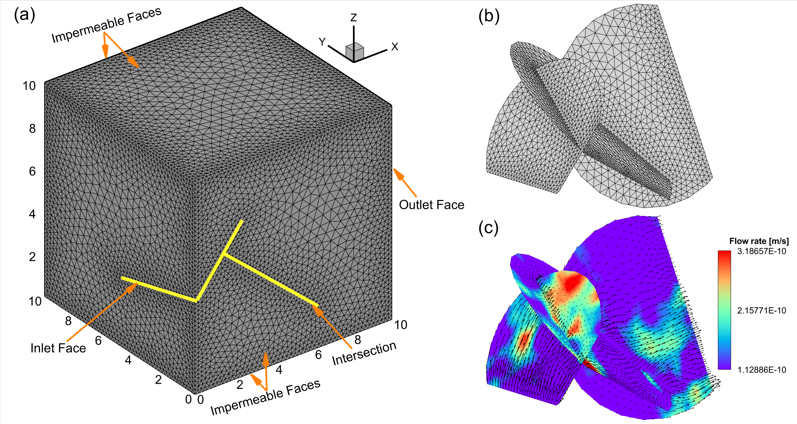

# MeshGenerator

`MeshGenerator.py` automates a DFN-to-TOUGH meshing workflow for fractured porous media simulations. It prepares DFN and matrix meshes, runs the external meshing and conversion tools used by this project, and assembles TOUGH-style `MESH` and `INCON` files.

This repository is intended for file-based research workflows in which upstream tools exchange intermediate files such as `InputResult.txt`, `InputResult.poly`, `matrix.uge`, and `dfn.uge`.

## Overview

The script can run the full preprocessing workflow:

1. Run `DFNsMeshGenerator3D.bat` to generate DFN surface meshes.
2. Trim DFN nodes and cells to a target bounding box.
3. Clean the TetGen `.poly` boundary file.
4. Run TetGen under WSL to generate the matrix mesh.
5. Convert TetGen output into the formats expected by LaGriT.
6. Run LaGriT conversions for DFN and matrix meshes.
7. Build TOUGH `MESH`, `MESH_inactive`, and `INCON` files from `matrix.uge` and `dfn.uge`.

If the UGE files already exist, the script can skip meshing and rebuild only the TOUGH outputs.

## Example Output



## Repository Layout

- `MeshGenerator.py`: main workflow script
- `Example for Mesh Generation/`: example case with representative inputs and generated outputs
- `Fig.png`: example visualization of the generated mesh

## Prerequisites

Before using this workflow, you should already be familiar with the tools and file formats involved. The pipeline depends on several external programs and assumes they are available in the working directory used by the script.

External software used by this workflow:

- `toughio`: https://github.com/keurfonluu/toughio
- `TetGen`: https://wias-berlin.de/software/index.jsp?id=TetGen&lang=1
- `LaGriT`: https://lagrit.lanl.gov/
- `DFNsMeshGenerator3D`: https://github.com/wywy941/DFNsMeshGenerator3D
- `dfnWorks`: https://dfnworks.lanl.gov/

Related software:

- `TOUGHREACT` can be licensed through https://tough.lbl.gov/software/toughreact_v4-13-omp/

The workflow is relatively specialized. You should review the requirements and conventions of DFNsMeshGenerator3D, TetGen, LaGriT, `toughio`, and TOUGH mesh generation before adapting it to a new case.

## Required Inputs

The script assumes the working directory contains the executables, helper scripts, and mesh inputs required by the selected stage. Typical files include:

- `DFNsMeshGenerator3D.bat`
- `tetgen`
- `lagrit`
- `convert_dfn.lgi`
- `convert_matrix.lgi`
- `InputResult.txt`
- `InputResult.poly`
- `matrix.uge`
- `dfn.uge`

Generated intermediate and output files commonly include:

- `dfn_withBoundary.inp`
- `dfn.inp`
- `Input.poly`
- `Input.1.vtk`
- `matrix.inp`
- `matrix_new.inp`
- `MESH`
- `MESH_inactive`
- `INCON`

## Quick Start

Show the command-line interface:

```bash
python MeshGenerator.py --help
```

Run the complete workflow in the current directory:

```bash
python MeshGenerator.py --stage pipeline
```

Rebuild only TOUGH `MESH` and `INCON` from existing UGE files:

```bash
python MeshGenerator.py --stage tough
```

Run with explicit domain bounds:

```powershell
python MeshGenerator.py `
  --workdir . `
  --x-min 5 --x-max 105 `
  --y-min 5 --y-max 105 `
  --z-min 5 --z-max 305 `
  --aperture 1.0e-4 `
  --code TOUGH2
```

## Command-Line Options

- `--workdir`: workflow directory. Default: `.`
- `--stage`: `pipeline` or `tough`. Default: `pipeline`
- `--x-min`, `--x-max`: x-direction trimming bounds. Default: `5.0`, `105.0`
- `--y-min`, `--y-max`: y-direction trimming bounds. Default: `5.0`, `105.0`
- `--z-min`, `--z-max`: z-direction trimming bounds. Default: `5.0`, `305.0`
- `--aperture`: fracture aperture used when building TOUGH files. Default: `1.0e-4`
- `--code`: simulator family identifier. Default: `TOUGH2`
- `--dfn-material-id`: keep only DFN cells with material IDs less than or equal to this value. Default: `2`
- `--log-level`: `DEBUG`, `INFO`, `WARNING`, or `ERROR`. Default: `INFO`

## Notes

- TetGen and LaGriT are executed through WSL from Python.
- The workflow is tightly coupled to the file names and conventions used in this repository.
- The script supports both the full pipeline and a TOUGH-only rebuild path.
- Review the default bounds, aperture, and material filtering before using the script on a different case.

## Contact

Questions or collaboration inquiries: https://tianjiahuang.github.io/
